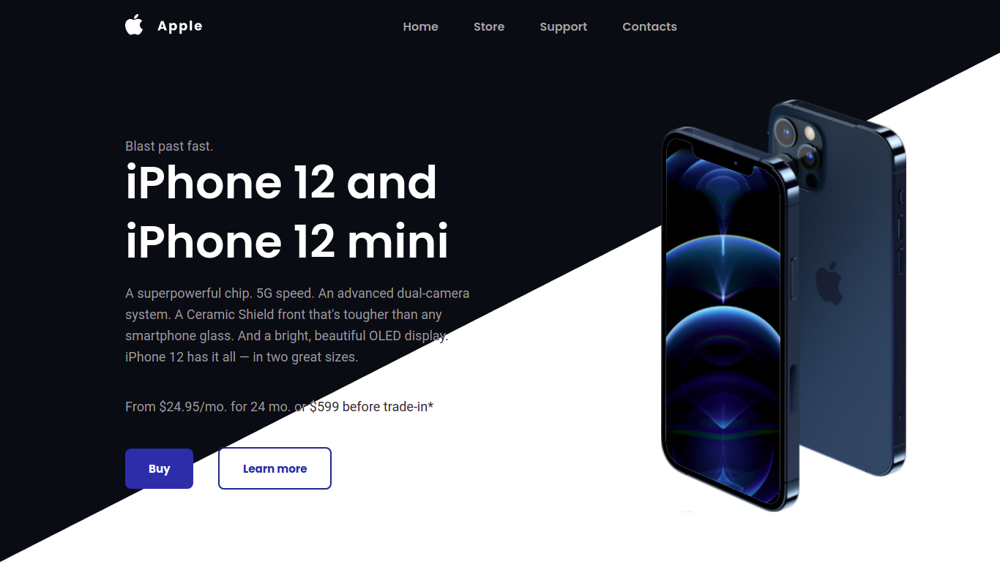

<h1 align="center">
    
</h1>

<div align="center">
    
    
</div>

<h1 align="center">
    
</h1>

<h3 align="center">You can access the project <a href="https://iphone-responsive-lading-page.netlify.app/" target="_blank">Clicking here</a></h3>
<p align="center">Appliction developed to learning effects. The UI in figma can be seen in <a href="https://www.figma.com/file/erJH94rz1HwwM0xwfKkJ4Y/iPhone-Responsive-Web-Site?node-id=102%3A2" target="_blank">Figma</a> </p>

---

</br>

# 🚀 Technologies:

- [HTML](https://www.w3schools.com/html/)
- [CSS](https://www.w3schools.com/css/)
- [JavaScript](https://developer.mozilla.org/en-US/docs/Web/JavaScript)
- [GSAP](https://greensock.com/gsap/)

---

<br/>

## 🛠 How to download the project:

```bash
# Clone the repository
$ git clone git@github.com:kennedybarros/iphone-responsive-landing-page.git

# Enter directory
$ cd iphone-responsive-landing-page
```

---
## 📝 Licença

This project is under license. see the file [LICENSE](LICENSE.md) for more details.

---


<p align="center"> Developed by <a href="https://www.linkedin.com/in/kennedybarros/">Kennedy Barros</a> ✌🏼</p>
